```{r setup, include=FALSE}
knitr::opts_chunk$set(echo = TRUE, warning = FALSE, message = FALSE, fig.width = 10, fig.height = 6)

library(tidyverse)
library(knitr)
library(kableExtra)
library(leaflet)
library(htmlwidgets)
```

# Abstract

This study presents the first comprehensive photographic documentation of butterfly diversity in Booni, Upper Chitral, Pakistan. Through field-based surveys conducted between April 2020 and October 2021, 23 butterfly species across 5 families were documented with 37 total observations. The study area spans an elevation gradient of 2,105-2,571 meters, representing montane butterfly communities of the Hindu Kush region. Butterflies were documented across diverse habitats including agricultural lands, mountain slopes, streams and rivers, meadows, wildlands, and home gardens. This baseline inventory provides essential data for future biodiversity monitoring and conservation planning in this climatically sensitive region.

# Introduction

Upper Chitral represents a critical biodiversity hotspot within the Hindu Kush mountain range, yet remains significantly understudied for invertebrate diversity. Booni, as the administrative headquarters of Upper Chitral, serves as an ideal location for baseline biodiversity documentation. Butterflies serve as valuable indicators of ecosystem health and climate change impacts in mountain environments.

This study aims to:

1. Document butterfly species diversity in Booni
2. Establish baseline data for future monitoring
3. Analyze elevational and temporal patterns
4. Create a photographic reference collection

# Study Area

**Location:** Booni, Upper Chitral District, Khyber Pakhtunkhwa, Pakistan  
**Coordinates:** 36°15'N, 72°15'E  
**Elevation Range:** 2,105 - 2,571 meters above sea level  
**Survey Period:** April 2020 - October 2021 (18 months)  
**Habitat Types:** Agricultural lands, mountain slopes, streams and rivers, meadows, wildlands, and home gardens

```{r load-data}
# Load data
butterflies <- read_csv("../data/cleaned/booni_butterflies_cleaned.csv", show_col_types = FALSE)
species_checklist <- read_csv("../outputs/tables/species_checklist.csv", show_col_types = FALSE)
```

# Methods

Butterfly observations were documented through field-based photography in Booni and surrounding areas between April 2020 and October 2021. Butterflies were photographed when encountered across diverse habitats including agricultural lands, mountain slopes, streams and rivers, meadows, wildlands, and home gardens. Each observation was photographed using a Redmi Note 10 Pro mobile phone camera and georeferenced using GPS. Species identifications were verified through consultation with Ackram Awan (butterfly expert, Pakistan), the iNaturalist community identification system, and regional field guides.

**Data Collection:**
- Photography-based documentation across multiple habitat types
- GPS coordinates and elevation recorded for each observation
- Date, time, and habitat type documented
- Species identified to species level through expert consultation

**Survey Habitats:**
- Agricultural lands and croplands
- Mountain slopes and hillsides  
- Streams and riverine areas
- Meadows and grasslands
- Wildlands and natural vegetation
- Home gardens

**Data Analysis:**
All analyses were conducted in R (version 4.5.1). Spatial analysis used `sf` and `leaflet` packages, while visualizations employed `ggplot2` and `viridis` color schemes.

# Results

## Species Diversity

A total of **23 butterfly species** from **5 families** were documented across **37 observations**.

```{r family-summary}
family_summary <- species_checklist %>%
  group_by(Family) %>%
  summarise(Species = n(), .groups = "drop") %>%
  arrange(desc(Species)) %>%
  mutate(Percentage = round(100 * Species / sum(Species), 1))

kable(family_summary, 
      col.names = c("Family", "Species Count", "Percentage (%)"),
      caption = "Butterfly family diversity in Booni") %>%
  kable_styling(bootstrap_options = c("striped", "hover"))
```

```{r family-plot, fig.cap="Distribution of butterfly species across families"}
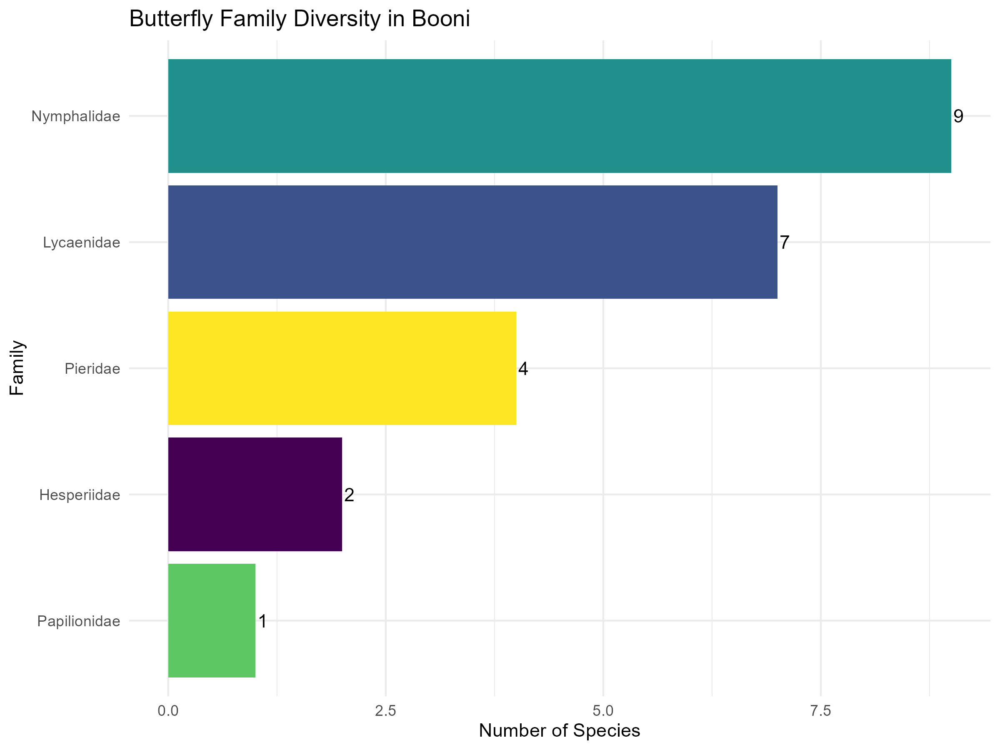
```

### Dominant Families

**Nymphalidae** (Brush-footed butterflies) and **Lycaenidae** (Blues, Hairstreaks, Coppers) were the most diverse families, collectively representing 65% of documented species. This pattern is typical of Himalayan montane butterfly communities.

## Complete Species Checklist

```{r species-list}
checklist_display <- species_checklist %>%
  mutate(
    Date = format(Date, "%d %b %Y"),
    Elevation_m = round(Elevation_m, 0)
  ) %>%
  select(
    `#` = Species_ID,
    Family,
    `English Name` = EnglishName,
    `Scientific Name` = ScientificName,
    `First Observed` = Date,
    `Elevation (m)` = Elevation_m
  )

kable(checklist_display,
      caption = "Annotated checklist of butterfly species from Booni") %>%
  kable_styling(bootstrap_options = c("striped", "hover", "condensed"), 
                font_size = 11) %>%
  column_spec(4, italic = TRUE)
```

## Temporal Patterns

```{r temporal-plot, fig.cap="Seasonal distribution of butterfly observations"}
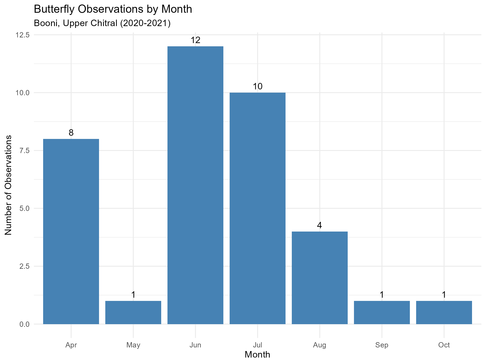
```

Peak butterfly activity occurred during **June-July**, with 13 observations recorded during this period. Spring emergence (April-May) showed moderate activity with 8 observations, while late season records (August-October) were limited.

```{r accumulation-plot, fig.cap="Species accumulation curve showing discovery rate over time"}
include_graphics("../outputs/figures/04_species_accumulation.png")
```

The species accumulation curve demonstrates continued discovery of new species throughout the survey period, suggesting that additional survey effort would likely yield more species records.

## Elevational Patterns

```{r elevation-plot, fig.cap="Distribution of observations across elevation gradient"}
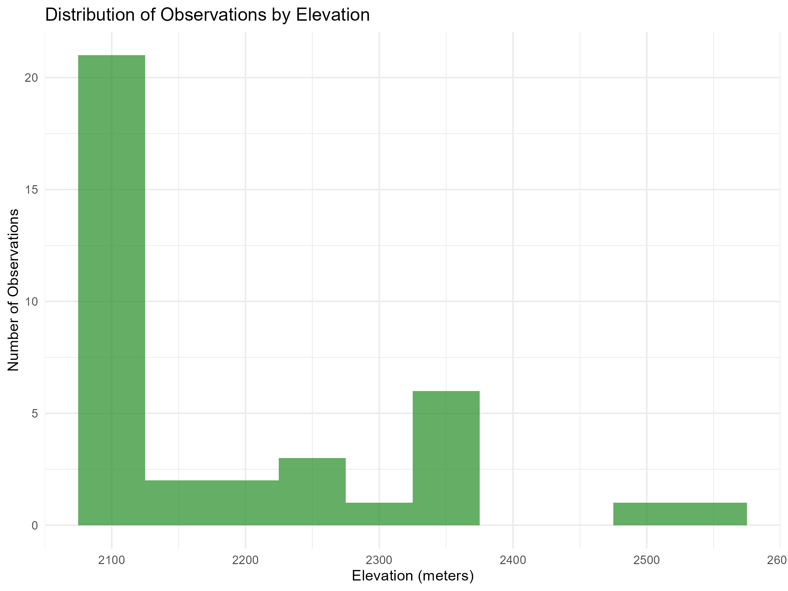
```

```{r elevation-ranges, fig.cap="Elevation ranges for each butterfly species"}
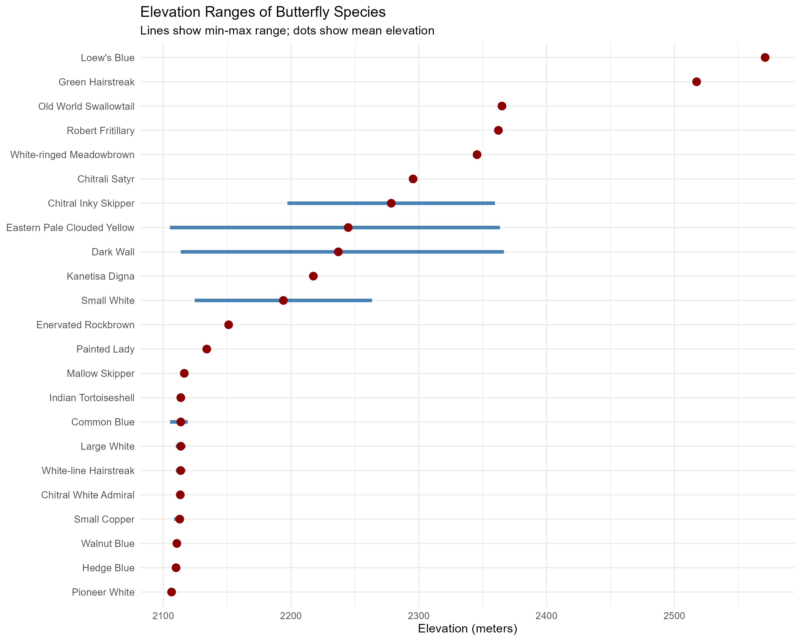
```

Observations spanned a **466-meter elevation gradient** (2,105-2,571m). Species showed varying elevational preferences:

- **Highest record:** Loew's Blue (*Plebejidea loewii*) at 2,571m
- **Lowest record:** Common Blue (*Polyommatus icarus*) at 2,105m

```{r elevation-family, fig.cap="Elevation distribution by family"}
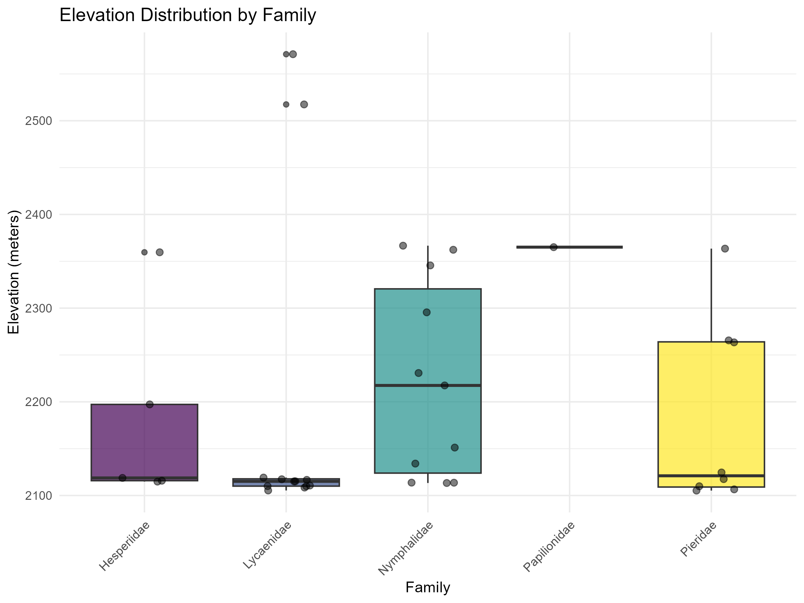
```

## Spatial Distribution

```{r map, fig.cap="Interactive map of butterfly observations (open in browser for full functionality)"}
# Load and display the interactive map
map_file <- "../outputs/maps/booni_butterfly_map.html"
if(file.exists(map_file)) {
  include_url(map_file)
} else {
  cat("Map file not found. Run 02_spatial_analysis.R first.")
}
```

Observations were concentrated in accessible areas around Booni town and nearby agricultural zones, with some records from higher elevation sites during spring-summer expeditions.

# Species Accounts

## Family Lycaenidae (Blues, Hairstreaks, Coppers)

### Common Blue (*Polyommatus icarus*)
**First observed:** 22 June 2020  
**Elevation:** 2,117m  
One of the most widespread butterfly species, observed at multiple locations throughout the survey period.


### Small Copper (*Lycaena phlaeas*)
**First observed:** 30 July 2020  
**Elevation:** 2,115m  
Small, vibrant copper-colored butterfly frequently observed in open areas.


### Hedge Blue (*Holarctic azures*)
**First observed:** 12 June 2020  
**Elevation:** 2,110m  
Small blue butterfly found in hedgerows and garden areas.


### Walnut Blue (*Chaetoprocta odata*)
**First observed:** 4 July 2020  
**Elevation:** 2,111m  
Associated with walnut trees, an important species for agricultural landscapes.


### White-line Hairstreak (*Satyrium deria*)
**First observed:** 12 June 2020  
**Elevation:** 2,110m  
Distinctive hairstreak with characteristic white line markings.


### Green Hairstreak (*Callophrys rubi*)
**First observed:** 23 April 2021  
**Elevation:** 2,517m  
Bright green underwing, found at highest elevations in the study.

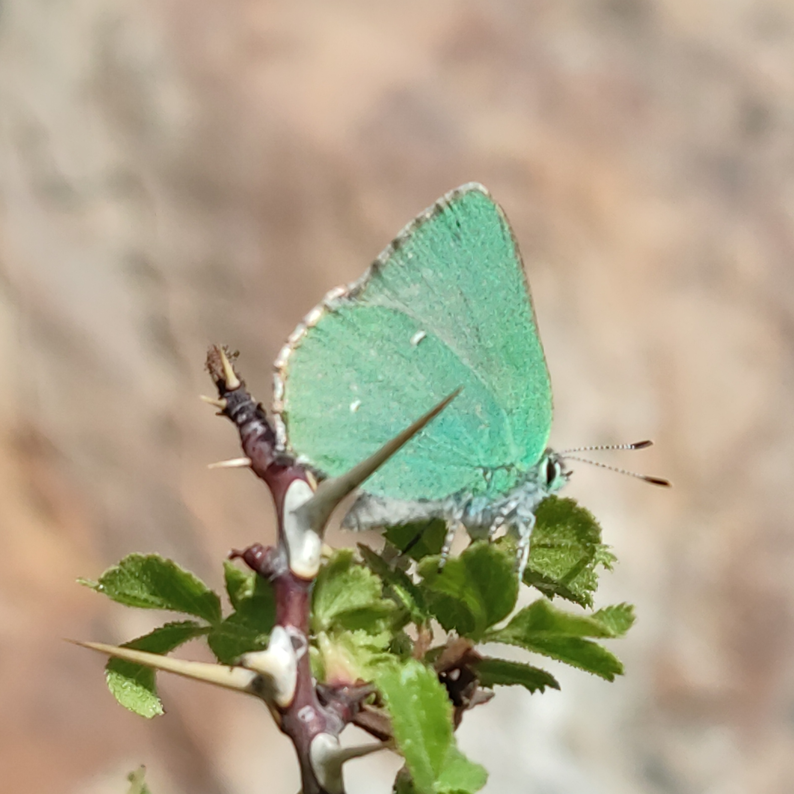

### Loew's Blue (*Plebejidea loewii*)
**First observed:** 12 June 2021  
**Elevation:** 2,571m  
Recorded at the highest elevation of all species in this survey.


## Family Nymphalidae (Brush-footed Butterflies)

### Painted Lady (*Vanessa cardui*)
**First observed:** 12 June 2020  
**Elevation:** 2,134m  
Cosmopolitan species, one of the most widespread butterflies globally.


### Indian Tortoiseshell (*Aglais cashmirensis*)
**First observed:** 3 April 2021  
**Elevation:** 2,114m  
Regional species found in the Himalayan region.

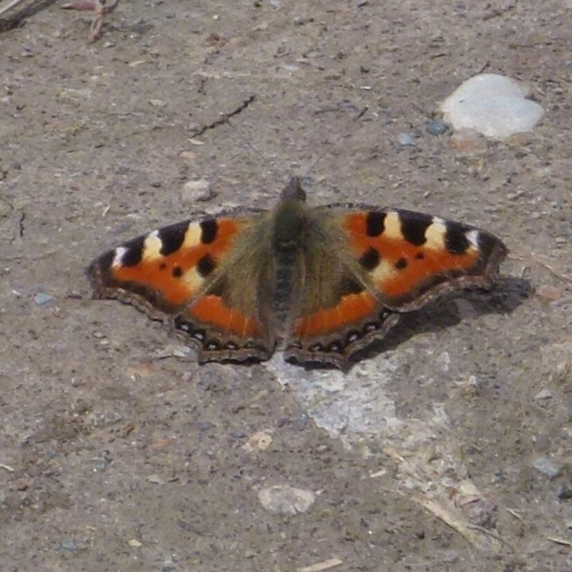

### Dark Wall (*Lasiommata menava*)
**First observed:** 4 June 2020  
**Elevation:** 2,231m  
Brown butterfly frequently observed on stone walls and rocky areas.

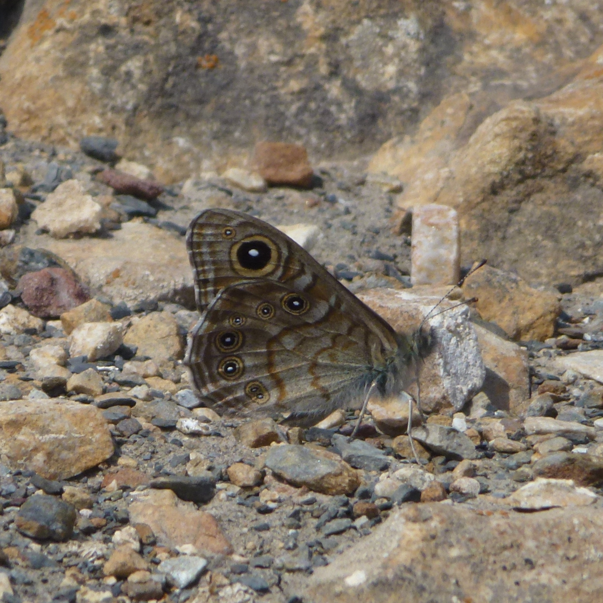

### Chitrali Satyr (*Satyrus pimpla*)
**First observed:** 20 July 2020  
**Elevation:** 2,296m  
Named after the Chitral region, a species of conservation interest.

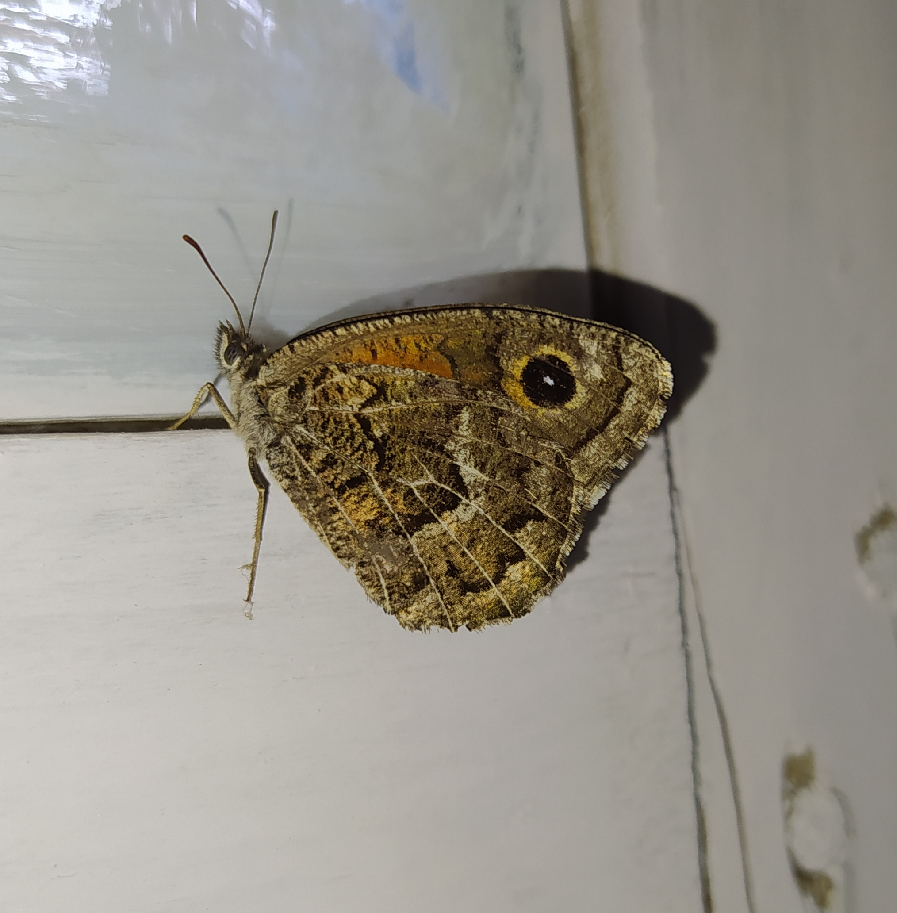

### Enervated Rockbrown (*Chazara enervata*)
**First observed:** 12 June 2021  
**Elevation:** 2,151m  
Mountain specialist found on rocky slopes.


### White-ringed Meadowbrown (*Hyponephele davendra*)
**First observed:** 12 June 2021  
**Elevation:** 2,346m  
Distinctive white-ringed pattern on wings.


### Kanetisa Digna (*Kanetisa digna*)
**First observed:** 12 June 2020  
**Elevation:** 2,217m  
Less common nymphalid species in the region.


### Chitral White Admiral (*Limenitis lepechini*)
**First observed:** 20 June 2021  
**Elevation:** 2,113m  
Regional endemic named after the Chitral valley.

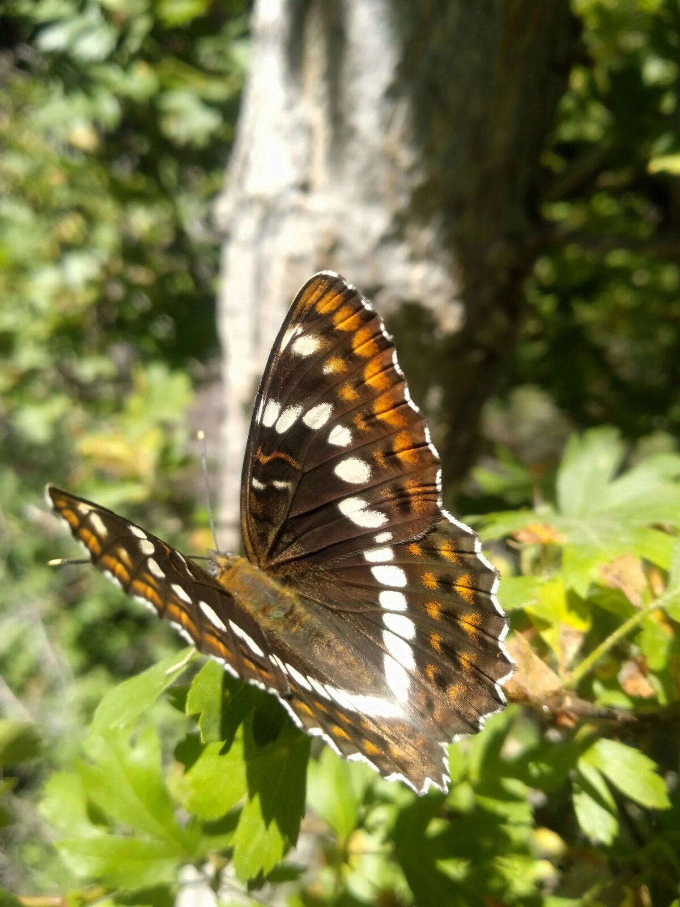

### Robert Fritillary (*Melitaea robertsi*)
**First observed:** 26 April 2021  
**Elevation:** 2,362m  
Attractive fritillary with distinctive checkered pattern.


## Family Pieridae (Whites and Yellows)

### Large White (*Pieris brassicae*)
**First observed:** 12 June 2020  
**Elevation:** 2,110m  
Common agricultural pest species, found near vegetable gardens.


### Small White (*Pieris rapae*)
**First observed:** 20 July 2020  
**Elevation:** 2,263m  
Smaller relative of Large White, equally common.


### Pioneer White (*Belenois aurota*)
**First observed:** 9 September 2020  
**Elevation:** 2,107m  
Migratory species occasionally reaching the region.


### Eastern Pale Clouded Yellow (*Colias erate*)
**First observed:** 19 July 2020  
**Elevation:** 2,266m  
Pale yellow butterfly common in meadows and open areas.


## Family Hesperiidae (Skippers)

### Mallow Skipper (*Carcharodus alceae*)
**First observed:** 22 June 2020  
**Elevation:** 2,116m  
Small, fast-flying skipper associated with mallow plants.


### Chitral Inky Skipper (*Erynnis pathan*)
**First observed:** 19 July 2020  
**Elevation:** 2,197m  
Regional endemic species, important for local biodiversity.

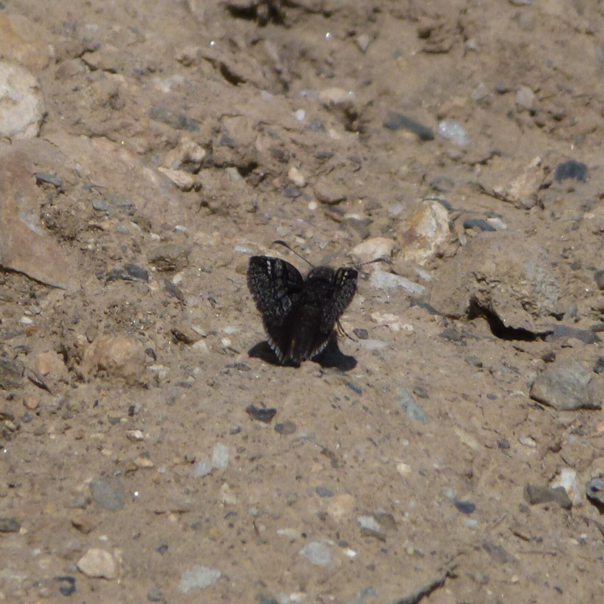

## Family Papilionidae (Swallowtails)

### Old World Swallowtail (*Papilio machaon*)
**First observed:** 29 April 2021  
**Elevation:** 2,365m  
Large, distinctive species and the only swallowtail recorded during the survey.


# Discussion

## Regional Significance

This study represents the first systematic documentation of butterfly diversity for Booni, Upper Chitral. The 23 species documented across diverse habitat types provide valuable baseline data for the region. The survey methodology, combining field expertise and modern technology (mobile photography and GPS), demonstrates an effective approach for biodiversity documentation in remote mountain regions.

## Notable Records

Several species of regional significance were documented:

1. **Chitral Inky Skipper** (*Erynnis pathan*) - Regional endemic
2. **Chitrali Satyr** (*Satyrus pimpla*) - Named after the Chitral region
3. **Chitral White Admiral** (*Limenitis lepechini*) - Uncommon species

## Conservation Implications

The elevation gradient documented (2,105-2,571m) represents a critical zone for monitoring climate change impacts. Montane butterflies in the Hindu Kush are particularly vulnerable to warming temperatures and habitat modification.

## Limitations

- Survey coverage limited to accessible areas within Booni and immediate surroundings
- Surveys conducted during daylight hours only
- Seasonal coverage focused on warmer months (April-October)
- High-elevation and remote areas undersampled due to accessibility constraints

# Conclusions

This baseline survey establishes foundational data on butterfly diversity in Booni, Upper Chitral. The documentation of 23 species across diverse families and habitats demonstrates the area's ecological value. Future research should focus on:

- Extended seasonal surveys covering all months
- Larval host plant associations
- Population monitoring of endemic species
- Climate change vulnerability assessments
- Systematic sampling of underexplored high-elevation sites

# Acknowledgments

Sincere gratitude to Mr. Ackram Awan, butterfly expert of Pakistan, for his invaluable assistance with species identifications and taxonomic verification. Thanks to the iNaturalist community for additional identification support.

# References

1. iNaturalist. (2020-2021). Community species identifications. Available at: https://www.inaturalist.org/people/syed_inzimam

2. Awan, A. Personal communication. Expert identification and verification of butterfly species from Upper Chitral.

3. Bingham, C.T. (1905-1907). The Fauna of British India, Including Ceylon and Burma: Butterflies (Vols. 1-2). Taylor and Francis, London.

4. Wynter-Blyth, M.A. (1957). Butterflies of the Indian Region. Bombay Natural History Society, Mumbai.

---

**Data Availability:** All observation data, photographs, and R code are available at: [https://github.com/Syedinzimam]

**Contact:** [inzimamsyed12@gmail.com]

```{r session-info}
sessionInfo()
```
